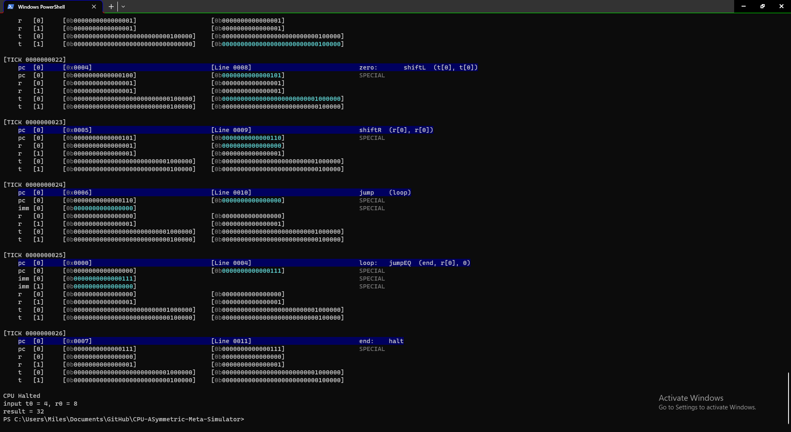

# (CPU-ASMS) CPU-ASymmetric-Meta-Simulator
A Meta CPU Simulator Engine to allow simulation of Custom CPU Architectures and Low Level Algorithms

**Note: This project was originally created in github repository** [ https://github.com/Medic5700/Book-of-Algorithms/blob/master/CPUsimulator.py ] [2020-06-19 -> 2023-05-25].
It has been moved here for continued development (**minus commit history**).

### Development Stack
- Python 3.13 or greater (required for variable annotations support)
- A terminal that supports ANSI (IE: default Ubuntu Terminal or the "Windows Terminal" app for Windows)

### Getting Started
- The current prototype version is in a non-functional state
- You can run the working Legacy Version ($ python LegacyV3-CPUsimulator.py). It's currently setup to show a quick demo when run.
- Note: The Legacy Version is not compatable in any way, shape, or form with the current version due to a complete engine rewrite.

### Links/References
- Level1Techs 2020 Devember Entry [https://forum.level1techs.com/t/a-cpu-simulator-where-you-program-the-instruction-set/163339/1]
- Level1Techs 2021 Devember Entry [https://forum.level1techs.com/t/devember-2021-cpu-simulating-engine-a-rewrite-from-last-devember/177322/1]
- Level1Techs mention for 2021 Devember [Level1Techs - Here are YOUR Level1Techs Devember 2021 Finalists!] [https://www.youtube.com/watch?v=7-e9abdlTes&t=427s]
- Original project repository [2020-06-19 -> 2023-05-25] [https://github.com/Medic5700/Book-of-Algorithms/blob/master/CPUsimulator.py]
